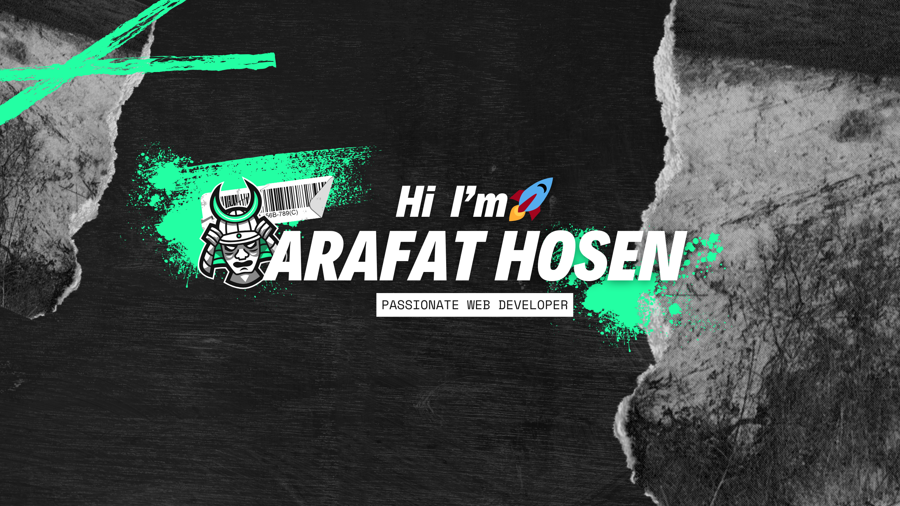

# 💫 About Me:

Hello there! 👋  
I'm **Arafat Hosen**, a passionate **web developer** with a strong interest in building responsive and user-friendly web applications. Currently, I'm pursuing my **Bachelor's degree in Physics**, but my heart is set on creating innovative solutions with **React.js** and **Next.js**.

- 🌱 I’m continuously learning and enhancing my skills in **frontend development**, with a focus on modern technologies like **TailwindCSS** and **Firebase**.  
- 🚀 I enjoy tackling real-world problems and creating elegant, efficient designs for the web.  
- 💡 In my free time, I explore new frameworks and work on personal projects to expand my expertise.  

## 🌐 Socials:
 

# 💻 Tech Stack:
                        
# 📊 GitHub Stats:

  

  

  

## 🏆 GitHub Trophies

### ✍️ Random Dev Quote

### 🔝 Top Contributed Repo

---

<!-- Proudly created with GPRM ( https://gprm.itsvg.in ) -->

<picture>
  <source media="(prefers-color-scheme: dark)" srcset="https://raw.githubusercontent.com/Arafat1652/Arafat1652/output/github-snake-dark.svg" />
  <source media="(prefers-color-scheme: light)" srcset="https://raw.githubusercontent.com/Arafat1652/Arafat1652/output/github-snake.svg" />
  
</picture>